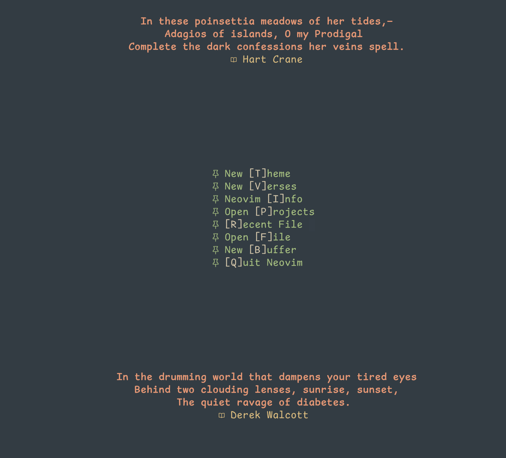
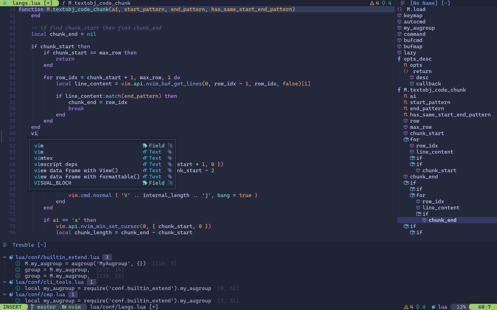
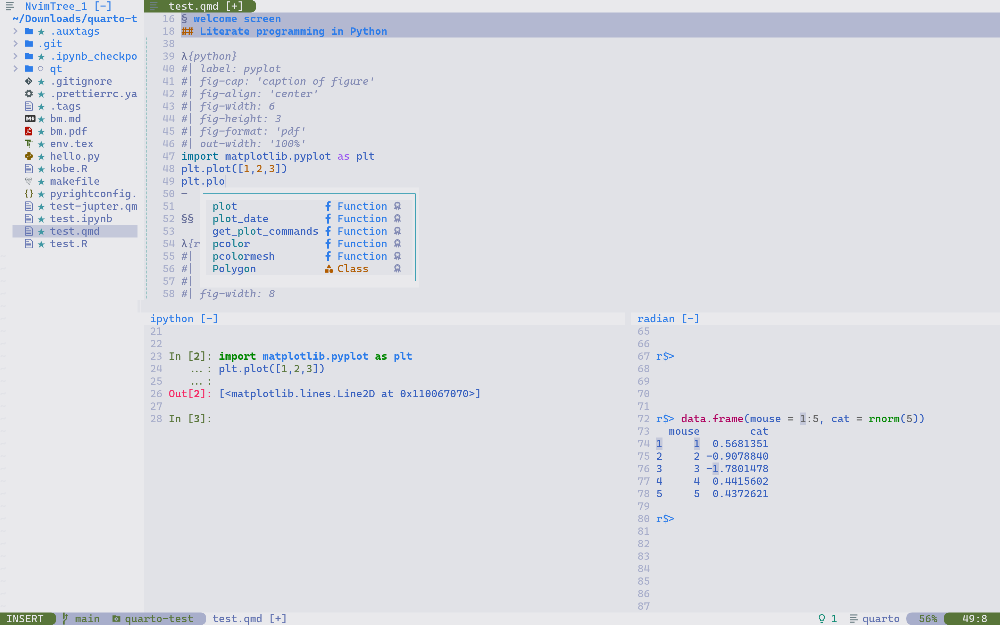
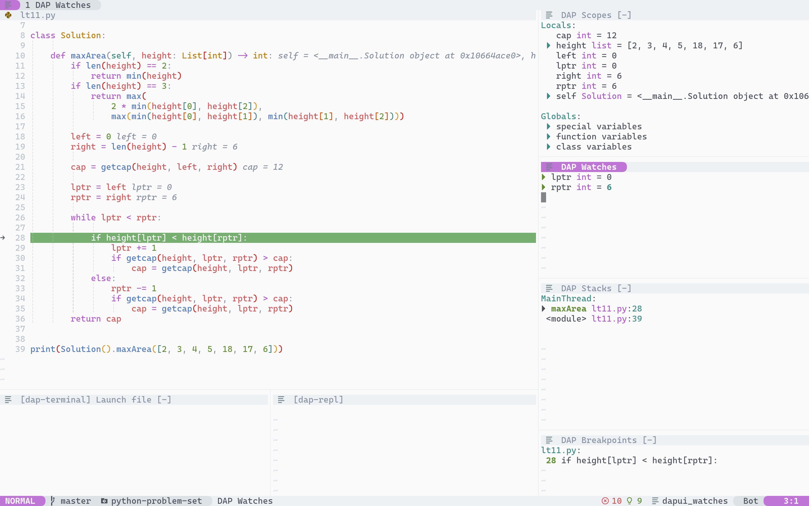

- [Features](#features)
  - [Modern Devtools Integration](#modern-devtools-integration)
  - [Powerful Text Edit Plugins](#powerful-text-edit-plugins)
  - [Tailored for Data Science](#tailored-for-data-science)
  - [Seamless Integration with Vscode](#seamless-integration-with-vscode)
  - [Be Wild](#be-wild)
- [Showcase](#showcase)
- [Dependencies](#dependencies)
  - [python deps](#python-deps)
  - [r deps](#r-deps)
  - [lua deps](#lua-deps)
  - [vimscript deps](#vimscript-deps)
  - [markdown deps](#markdown-deps)
  - [sql deps](#sql-deps)
  - [bash deps](#bash-deps)
  - [latex deps](#latex-deps)
  - [cpp deps](#cpp-deps)
  - [general purpose deps](#general-purpose-deps)
- [Keymaps](#keymaps)
  - [Builtin keymaps](#builtin-keymaps)
    - [Builtin movement keymaps](#builtin-movement-keymaps)
    - [Builtin window keymaps](#builtin-window-keymaps)
    - [Builtin tab keymaps](#builtin-tab-keymaps)
    - [Builtin buffer keymaps](#builtin-buffer-keymaps)
    - [Builtin navigation keymaps](#builtin-navigation-keymaps)
  - [Builtin miscellenous keymaps](#builtin-miscellenous-keymaps)
  - [UI keymaps](#ui-keymaps)
    - [Pretty quickfix list keymaps](#pretty-quickfix-list-keymaps)
  - [Utils keymaps](#utils-keymaps)
    - [File explorer keymaps](#file-explorer-keymaps)
    - [Window layout keymaps](#window-layout-keymaps)
  - [Text Edit keymaps](#text-edit-keymaps)
    - [Align text keymaps](#align-text-keymaps)
    - [Comment keymaps](#comment-keymaps)
    - [Text objects for functions keymaps](#text-objects-for-functions-keymaps)
    - [Quick navigation keymaps](#quick-navigation-keymaps)
    - [Text objects enhancement keymaps](#text-objects-enhancement-keymaps)
    - [Block text movement](#block-text-movement)
    - [Surround pairs keymaps](#surround-pairs-keymaps)
    - [substitution keymaps](#substitution-keymaps)
    - [Other text objects keymaps](#other-text-objects-keymaps)
  - [Integration with other tools](#integration-with-other-tools)
    - [Terminal emulator keymaps](#terminal-emulator-keymaps)
    - [Git keymaps](#git-keymaps)
    - [Ripgrep keymaps](#ripgrep-keymaps)
    - [Copilot keymaps](#copilot-keymaps)
  - [REPL keymaps](#repl-keymaps)
  - [Treesitter keymaps](#treesitter-keymaps)
    - [Syntax based text objects keymaps](#syntax-based-text-objects-keymaps)
    - [Syntaxa based navigations keymaps](#syntaxa-based-navigations-keymaps)
    - [Miscellenous](#miscellenous)
  - [Searcher keymaps](#searcher-keymaps)
  - [Language Server Protocol keymaps](#language-server-protocol-keymaps)
  - [Autocompletion keymaps](#autocompletion-keymaps)
  - [Debugger Adapter Protocol keymaps](#debugger-adapter-protocol-keymaps)
  - [orgmode keymaps](#orgmode-keymaps)
  - [Filetype Specific Keymaps](#filetype-specific-keymaps)
    - [R keymaps](#r-keymaps)
      - [Builtin keymaps for R](#builtin-keymaps-for-r)
      - [REPL keymaps for R](#repl-keymaps-for-r)
    - [Python keymaps](#python-keymaps)
      - [Builtin keymaps for Python](#builtin-keymaps-for-python)
    - [REPL keymaps for Python](#repl-keymaps-for-python)
    - [Rmarkdown keymaps](#rmarkdown-keymaps)
      - [Builtin keymaps for Rmarkdown](#builtin-keymaps-for-rmarkdown)
      - [Text objects keymaps for Rmarkdown](#text-objects-keymaps-for-rmarkdown)
      - [REPL keymaps for Rmarkdown](#repl-keymaps-for-rmarkdown)
      - [Rmarkdown preview keymaps](#rmarkdown-preview-keymaps)
    - [Markdown keymaps](#markdown-keymaps)
    - [Latex keymaps](#latex-keymaps)
- [Other Notes](#other-notes)
- [Discussion](#discussion)

# Features

## Modern Devtools Integration

Built on modern devtools including LSP and treesitter. Treesitter delivers
AST-level highlighting, text objects, and navigations, while LSP offers
features like auto completion, go to definition and reference, and code
diagnostics. By harnessing the power of both Ctags and LSP, this configuration
brings a harmonic blend of old-school and modern development tools.

## Powerful Text Edit Plugins

Vim's exceptional text editing capabilities are further amplified by a host of
powerful plugins focusing on text editing. (Remember it is pure text editing
makes vim vim.)

## Tailored for Data Science

This configuration is specifically tailored toward data science toolsets,
including python, R, SQL, Latex, rmarkdown, and quarto.

## Seamless Integration with Vscode

Curated configuration working together with vscode thanks to
[vscode-neovim](https://github.com/vscode-neovim/vscode-neovim). Access all the
familiar neovim keybindings, including translations of equivalent commands in
vscode, even when working with complex graphical content like Jupyter
notebooks. And many neovim plugins, such as treesitter, can be embedded
seamlessly in vscode, allowing for a smooth and uninterrupted workflow.

**NOTE**: If you plan to use this configuration with `vscode-neovim`, please
use the `windows/vscode` branch. If you wish to use neovim both in the terminal
and in vscode, we suggest creating two folders in `~/.config` or your specified
`$XDG_CONFIG` path. One is `~/.config/nvim`, which uses the default
configuration in the `master` branch, and the other is
`~/.config/vscode-neovim`, which uses the configuration in the `windows/vscode`
branch. This takes advantage of the `NVIM_APPNAME` feature in `nvim 0.9`.

There are two ways to ask `vscode-neovim` to use the configuration from the
`~/.config/vscode-neovim` folder as opposed to the default folder. Select the
method that suits your preference best:

1. Create a bash script like the following:

```bash
#!bin/bash
NVIM_APPNAME=vscode-neovim nvim "$@"
```

Then, in vscode, set `vscode-neovim.neovimExecutablePaths.darwin` to
`your_path/to_the/bash_script`, changing darwin to match your system.

2. Set `vscode-neovim.NVIM_APPNAME` to `vscode-neovim` in vscode settings.

## Be Wild

Randomly select a theme from a curated list each time you start up and
automatically switches between day and night themes at scheduled time.
Additionally, the displayed verses on the welcome screen is also randomized with
each launch. With neovim, you can have a fresh experience every time. Be casual
and wild!

# Showcase



- The welcome screen displays two verses randomly selected from my curated
  collection. You can select new verses and color schemes at random or access
  frequently used commands from this screen.



- This screenshot showcases writing Lua code with smart autocompletion through
  both language server (LSP) and universal-ctags (ctags). This combination
  seamlessly blends old-school and modern tools. The bottom window shows the
  occurrence of referenced symbols that you specify (via `lsp find references`), while the right window shows the symbol outline of the current
  file (via `lsp document symbols`).



- This screenshot demonstrates the use of literate programming in neovim, which
  is highly beneficial for data science workflows. You can write code in both
  Python and R with intelligent autocompletion from both LSP and Ctags in quarto
  or markdown files. Moreover, you can send your code to both R and Python REPL
  simultaneously.



- This screenshot demonstrates how to debug Python program in neovim. Stepping through
  the code and watching variables and stack frames, just like in vscode.

# Dependencies

You are responsible for installing the dependencies, but most of them are
optional. They consist mainly of language servers and linters that correspond
to their respective languages. You can choose the ones you need and leave out
the others. Even if certain dependencies are absent, neovim will still operate
and display notifications instead of halting completely.

If your system lacks a proper package manager, such as with Windows, or if the
packages are out of date, as with Debian, you can use `Mason.nvim`, a neovim
plugin specifically to install some of the dependencies. Dependencies marked
with a `*` can be installed through `Mason.nvim`. To install these packages
within neovim, enter `:Mason` in the prompt, and a popup window will appear
with the intuitive interface of `Mason`. From there, you can easily install
packages.

This configuration relies on an external tool called `efm-langserver`, which
can be installed via `mason`. However, it needs to be separately configured
outside of neovim. An example configuration for `efm` is provided in the `dist`
folder. To use this example configuration, simply copy the folder to
`~/.config/`.

## python deps

1. `python`.
2. `debugpy`: this module should be included by the `python` at the top of your `$PATH`.
3. `ipython`
4. `black*`
5. `efm-langserver*`
6. `pyright*`

## r deps

1. `r-language-server`: this is a R package that should be installed by the `r` at the top of your `$PATH`
2. `radian`

## lua deps

1. `lua-language-server*`
2. `stylua*`
3. `selene*`
4. `efm-langserver*`

## vimscript deps

1. `vim-language-server*`

## markdown deps

1. `prettierd*`
2. `vale*`
3. `efm-langserver*`

## sql deps

1. `sqls*`
2. `sql-formatter*`

## bash deps

1. `bash-language-server*`
2. `shellcheck*`

## latex deps

1. `texlab*`
2. `latexindent*`: while this package is shipped with `texlive`, `perl` shipped
   by macOS cannot run this program, so I use a `homebrew` installed
   `latexindent` instead.

## cpp deps

1. `clangd*`: Apple's `xcode` command line tools ship this for you.

## general purpose deps

1. `universal-ctags`

# Keymaps

NOTE: this only includes keymaps defined by myself,
and some of the default plugins keymaps
that I used frequently.

The `<Leader>` key is `<Space>`,
the `<LocalLeader>` key is `<Space><Space>` or `<Backslash>`.

In case you forget the keymaps
you can always use `<Leader>fk` (`:Telescope keymaps`)
to find all keymaps.

## Builtin keymaps

### Builtin movement keymaps

| Mode | LHS     | RHS/Functionality                 |
| ---- | ------- | --------------------------------- |
| ic   | `<C-b>` | `<Left>`                          |
| ic   | `<C-p>` | `<Up>`                            |
| ic   | `<C-f>` | `<Right>`                         |
| ic   | `<C-n>` | `<Down>`                          |
| ic   | `<C-a>` | Go to Beginning of the line       |
| ic   | `<C-e>` | Go to end of the line             |
| ic   | `<C-h>` | `<Backspace>`                     |
| ic   | `<C-k>` | Del chars from cursor to line end |
| ic   | `<C-d>` | Delete a char forwardly           |
| c    | `<A-f>` | Move cursor to next word          |
| c    | `<A-b>` | Move cursor to previous word      |
| ivt  | `jk`    | Switch to normal mode             |

### Builtin window keymaps

| Mode | LHS           | RHS/Functionality                    |
| ---- | ------------- | ------------------------------------ |
| n    | `<A-f>`       | Move current win to prev tab         |
| n    | `<A-b>`       | Move current win to next tab         |
| n    | `<A-w>`       | Go to next win                       |
| n    | `<A-p>`       | Go to Prev win                       |
| n    | `<A-t>`       | Move this win to new tab             |
| n    | `<A-q>`       | Del this win                         |
| n    | `<A-v>`       | Vertically split current win         |
| n    | `<A-s>`       | Horizontally split current win       |
| n    | `<A-h>`       | Go to win to the left                |
| n    | `<A-j>`       | Go to win to the below               |
| n    | `<A-k>`       | Go to win to the above               |
| n    | `<A-l>`       | Go to win to the right               |
| n    | `<A-H>`       | Move current win to the left         |
| n    | `<A-J>`       | Move current win to the below        |
| n    | `<A-K>`       | Move current win to the above        |
| n    | `<A-L>`       | Move current win to the right        |
| n    | `<A-o>`       | Make current win the only win        |
| n    | `<A-=>`       | Balance the win height/width         |
| n    | `<A-\|>`      | Maximize current win's width         |
| n    | `<A-_>`       | Maximize current win's height        |
| n    | `<A-<>`       | Decrease current win's width         |
| n    | `<A->>`       | Increase current win's width         |
| n    | `<A-+>`       | Increase current win's height        |
| n    | `<A-->`       | Decrease current win's height        |
| n    | `<A-]>`       | Downward scroll the float win        |
| n    | `<A-[>`       | Upward scroll the float win          |
| n    | `<Leader>wf`  | Move current win to prev tab         |
| n    | `<Leader>wb`  | Move current win to next tab         |
| n    | `<Leader>ww`  | Go to next win                       |
| n    | `<Leader>wp`  | Go to Prev win                       |
| n    | `<Leader>wT`  | Move this win to new tab             |
| n    | `<Leader>wq`  | Del this win                         |
| n    | `<Leader>wv`  | Vertically split current win         |
| n    | `<Leader>ws`  | Horizontally split current win       |
| n    | `<Leader>wh`  | Go to win to the left                |
| n    | `<Leader>wj`  | Go to win to the below               |
| n    | `<Leader>wk`  | Go to win to the above               |
| n    | `<Leader>wl`  | Go to win to the right               |
| n    | `<Leader>wH`  | Move current win to the left         |
| n    | `<Leader>wJ`  | Move current win to the below        |
| n    | `<Leader>wK`  | Move current win to the above        |
| n    | `<Leader>wL`  | Move current win to the right        |
| n    | `<Leader>wo`  | Make current win the only win        |
| n    | `<Leader>w=`  | Balance the win height/width         |
| n    | `<Leader>w]`  | Downward scroll the float win        |
| n    | `<Leader>w[`  | Upward scroll the float win          |
| n    | `<Leader>w\|` | Maximize current win's width         |
| n    | `<Leader>w_`  | Maximize current win's height        |
| n    | `<Leader>w]`  | Jump to `tags` in a new window       |
| n    | `<Leader>wg]` | Select a tag to jump in a new window |

### Builtin tab keymaps

| Mode | LHS              | RHS/Functionality                |
| ---- | ---------------- | -------------------------------- |
| n    | `<Leader><Tab>[` | Go to next tab                   |
| n    | `<Leader><Tab>]` | Go to prev tab                   |
| n    | `<Leader><Tab>n` | Create a new tab                 |
| n    | `<Leader><Tab>c` | Close current tab                |
| n    | `<Leader><Tab>o` | Close other tabs except this one |
| n    | `<Leader><Tab>h` | Move tab to the left             |
| n    | `<Leader><Tab>l` | Move tab to the right            |
| n    | `<Leader><Tab>1` | Go to 1st tab                    |
| n    | `<Leader><Tab>2` | Go to 2nd tab                    |
| n    | `<Leader><Tab>3` | Go to 3rd tab                    |
| n    | `<Leader><Tab>4` | Go to 4th tab                    |
| n    | `<Leader><Tab>5` | Go to 5th tab                    |
| n    | `<Leader><Tab>6` | Go to 6th tab                    |
| n    | `<Leader><Tab>7` | Go to 7th tab                    |
| n    | `<Leader><Tab>8` | Go to 8th tab                    |
| n    | `<Leader><Tab>9` | Go to 9th tab                    |

### Builtin buffer keymaps

| Mode | LHS          | RHS/Functionality      |
| ---- | ------------ | ---------------------- |
| n    | `<Leader>bd` | Delete current buffer  |
| n    | `<Leader>bw` | Wipeout current buffer |
| n    | `<Leader>bp` | Prev buffer            |
| n    | `<Leader>bn` | Next buffer            |

### Builtin navigation keymaps

| Mode | LHS  | RHS/Functionality                                         |
| ---- | ---- | --------------------------------------------------------- |
| n    | `]b` | Next buffer                                               |
| n    | `[b` | Previous buffer                                           |
| n    | `]q` | Next quickfix list entry                                  |
| n    | `[q` | Prev quickfix list entry                                  |
| n    | `]Q` | Set current quickfix list as newer one in qflist history  |
| n    | `[Q` | Set current quickfix list as older one in qflist history  |
| n    | `]t` | Go to next tag location for currently searched symbol     |
| n    | `[t` | Go to previous tag location for currently searched symbol |

## Builtin miscellenous keymaps

| Mode | LHS           | RHS/Functionality                                      |
| ---- | ------------- | ------------------------------------------------------ |
| n    | `<Leader>olx` | Open URI under cursor using xdg-open                   |
| n    | `<Leader>olw` | Open URI under cursor using w3m                        |
| n    | `<C-g>`       | `<ESC>`                                                |
| n    | `<Leader>mt`  | search current word from tags file and send to loclist |
| n    | `<Leader>mdc` | Set working dir as current file's dir                  |
| n    | `<Leader>mdu` | Set working dir up one level from current working dir  |
| n    | `<Leader>mc`  | Pick a color scheme                                    |
| n    | `<Leader>th`  | Toggle highlight serach (see `:h hlsearch`)            |
| n    | `<Leader>tH`  | Toggle cmdheight between 0 or 1 (see `:h cmdheight`)   |
| n    | `<Leader>tw`  | Toggle wrap (see `:h wrap`)                            |
| n    | `<Leader>tc`  | set `conceallevel` between 0 and 2 (see `:h wrap`)     |

## UI keymaps

### Pretty quickfix list keymaps

The following keymaps rely on [Trouble.nvim](https://github.com/folke/trouble.nvim.git)

| Mode | LHS          | RHS/Functionality                                   |
| ---- | ------------ | --------------------------------------------------- |
| n    | `<Leader>xw` | Toggle display of workspace diagnostics via Trouble |
| n    | `<Leader>xd` | Toggle display of document diagnostics via Trouble  |
| n    | `<Leader>xl` | Toggle display of loclist via Trouble               |
| n    | `<Leader>xq` | Toggle display of quickfix list via Trouble         |
| n    | `<Leader>xr` | Toggle display of lsp references via Trouble        |

## Utils keymaps

### File explorer keymaps

The following keymaps rely on [nvim-tree.lua](https://github.com/nvim-tree/nvim-tree.lua)

| Mode | LHS          | RHS/Functionality                                          |
| ---- | ------------ | ---------------------------------------------------------- |
| n    | `<Leader>et` | Toggle file explorer via Nvimtree                          |
| n    | `<Leader>ef` | Toggle file explorer fosusing on current file via Nvimtree |
| n    | `<Leader>er` | Refresh Nvimtree file explorer                             |

### Window layout keymaps

The following keymaps rely on [winshift.nvim](https://github.com/sindrets/winshift.nvim)

| Mode | LHS          | RHS/Functionality        |
| ---- | ------------ | ------------------------ |
| n    | `<Leader>wm` | Rearrange windows layout |

## Text Edit keymaps

### Align text keymaps

The following keymaps rely on [vim-easy-align](https://github.com/junegunn/vim-easy-align)

| Mode | LHS | RHS/Functionality                                                 |
| ---- | --- | ----------------------------------------------------------------- |
| nv   | ga  | Align the motion / text object / selected text by input separator |

### Comment keymaps

The following keymaps rely on [mini.comment](https://github.com/echasnovski/mini.nvim)

| Mode | LHS | RHS/Functionality                                            |
| ---- | --- | ------------------------------------------------------------ |
| nv   | gc  | Comment / uncomment the motion / text object / selected text |
| n    | gcc | Comment /uncomment current line                              |
| o    | gc  | Text object: a commented text block                          |

### Text objects for functions keymaps

The following keymaps rely on [dsf.vim](https://github.com/AndrewRadev/dsf.vim)

| Mode | LHS  | RHS/Functionality                                     |
| ---- | ---- | ----------------------------------------------------- |
| n    | dsf  | Delete a function call, don't delete the arguments    |
| n    | dsnf | Delete next function call, don't delete the arguments |
| n    | csf  | Change a function call, keep arguments the same       |
| n    | csnf | Change next function call, keep arguments the same    |

### Quick navigation keymaps

The following keymaps rely on [vim-sneak](https://github.com/justinmk/vim-sneak)

| Mode | LHS | RHS/Functionality                       |
| ---- | --- | --------------------------------------- |
| nvo  | f   | Find the next input character           |
| nvo  | F   | Find the previous input character       |
| nvo  | t   | Guess from `t` vs `f` for vanilla vim   |
| nvo  | T   | Guess from `T` vs `F` for vanilla vim   |
| nv   | s   | Find the next 2 input chars             |
| o    | z   | Motion: Find the next 2 input chars     |
| n    | S   | Find the previous 2 input chars         |
| ov   | Z   | Motion: Find the previous 2 input chars |

### Text objects enhancement keymaps

The following keymaps rely on [mini.ai](https://github.com/echasnovski/mini.nvim)

| Mode | LHS  | RHS/Functionality                                             |
| ---- | ---- | ------------------------------------------------------------- |
| ov   | an   | Text object: find the next following "around" text object     |
| ov   | aN   | Text object: find the previous following "around" text object |
| ov   | in   | Text object: find the next following "inner" text object      |
| ov   | iN   | Text object: find the previous following "inner" text object  |
| nov  | `g(` | Motion: go to the start of the following "around" text object |
| nov  | `g)` | Motion: go to the end of the following "around" text object   |

### Block text movement

The following keymaps rely on [mini.move](https://github.com/echasnovski/mini.nvim)

| Mode | LHS     | RHS/Functionality            |
| ---- | ------- | ---------------------------- |
| v    | `<A-h>` | Move left the block of text  |
| v    | `<A-j>` | Move down the block of text  |
| v    | `<A-k>` | Move up the block of text    |
| v    | `<A-l>` | Move right the block of text |

### Surround pairs keymaps

The following keymaps rely on [mini.surround](https://github.com/echasnovski/mini.nvim)

| Mode | LHS | RHS/Functionality                                          |
| ---- | --- | ---------------------------------------------------------- |
| n    | yss | Add a surround pair for the whole line                     |
| n    | ys  | Add a surround pair for the following motion / text object |
| n    | yS  | Add a surround pair from cursor to line end                |
| v    | S   | Add a surround pair for selected text                      |
| n    | cs  | Change the surround pair                                   |
| n    | ds  | Delete the surround pair                                   |

### substitution keymaps

The following keymaps rely on [substitute.nvim](https://github.com/gbprod/substitute.nvim)

| Mode | LHS | RHS/Functionality                                                                                      |
| ---- | --- | ------------------------------------------------------------------------------------------------------ |
| nv   | gs  | Substitute the motion / text object / selected text by latest pasted text, don't cut the replaced text |
| n    | gss | Similar to `gs`, operate on the whole line                                                             |
| n    | gS  | Similar to `gs`, operate on text from cursor to line end                                               |

### Other text objects keymaps

The following keymaps rely on [vim-textobj-beween](https://github.com/thinca/vim-textobj-between)

| Mode | LHS | RHS/Functionality                                    |
| ---- | --- | ---------------------------------------------------- |
| ov   | ab  | Text object: around text between the input character |
| ov   | ib  | Text object: inner text between the input character  |

The following keymaps rely on [vim-textobj-chainmember](https://github.com/D4KU/vim-textobj-chainmember)

| Mode | LHS | RHS/Functionality                                     |
| ---- | --- | ----------------------------------------------------- |
| ov   | a.  | Text object: around a chain of chained method calls   |
| ov   | i.  | Text object: inner of a chain of chained method calls |

## Integration with other tools

### Terminal emulator keymaps

The following keymaps rely on [toggleterm.nvim](https://github.com/akinsho/toggleterm.nvim)

| Mode | LHS          | RHS/Functionality                                        |
| ---- | ------------ | -------------------------------------------------------- |
| n    | `<Leader>ot` | open the `n`th terminal, e.g `<Leader>ot`, `2<Leader>ot` |
| n    | `<Leader>t0` | Toggle all terminals                                     |
| n    | `<Leader>t!` | Terminate the `n`th terminal                             |
| n    | `<Leader>t1` | Toggle the 1st terminal                                  |
| n    | `<Leader>t2` | Toggle the 2nd terminal                                  |
| n    | `<Leader>t3` | Toggle the 3rd terminal                                  |
| n    | `<Leader>t4` | Toggle the 4th terminal                                  |

### Git keymaps

The following keymaps rely on [gitsigns.nvim](https://github.com/lewis6991/gitsigns.nvim)

| Mode | LHS          | RHS/Functionality             |
| ---- | ------------ | ----------------------------- |
| n    | `<Leader>gp` | Preview current git diff hunk |
| n    | `<Leader>ga` | Git actions                   |
| n    | `<Leader>gs` | Stage current git diff hunk   |
| n    | `<Leader>gr` | Reset current git diff hunk   |
| n    | `<Leader>gq` | Send git diff hunks to qflist |
| n    | `]h`         | Go to next git diff hunk      |
| n    | `[h`         | Go to previous git diff hunk  |

The following keymaps rely on [neogit](https://github.com/TimUntersberger/neogit)

| Mode | LHS          | RHS/Functionality         |
| ---- | ------------ | ------------------------- |
| n    | `<Leader>gg` | Open Neogit git dashboard |

The following keymaps rely on [diffview.nvim](https://github.com/sindrets/diffview.nvim)

| Mode | LHS          | RHS/Functionality                           |
| ---- | ------------ | ------------------------------------------- |
| n    | `<Leader>gd` | Compare git diff for current file with HEAD |
| n    | `<Leader>gf` | Open git diff view for commits history      |

### Ripgrep keymaps

The following keymaps rely on [nvim-spectre](https://github.com/nvim-pack/nvim-spectre)

| Mode | LHS          | RHS/Functionality                                                                                      |
| ---- | ------------ | ------------------------------------------------------------------------------------------------------ |
| nv   | `<Leader>fR` | Open ripgrep search panel (to show searched results of selected text if on visual mode) in the project |

### Copilot keymaps

The following keymaps rely on [copilot.lua](https://github.com/zbirenbaum/copilot.lua)

| Mode | LHS          | RHS/Functionality                     |
| ---- | ------------ | ------------------------------------- |
| n    | `<Leader>tg` | Toggle auto-suggestion for copilot    |
| i    | `<M-Y>`      | Accept the whole suggestion           |
| i    | `<M-y>`      | Accept suggestion of current line     |
| i    | `<M-[>`      | Show previous suggestion from copilot |
| i    | `<M-]>`      | Show next suggestion from copilot     |

## REPL keymaps

Note: with no numerical argument, the REPL is default for the first REPL.

| Mode | LHS               | RHS/Functionality                                                                               |
| ---- | ----------------- | ----------------------------------------------------------------------------------------------- |
| n    | `<Leader>tR`      | Toggle float win for REPL                                                                       |
| n    | `<LocalLeader>rs` | Start REPL `i`, e.g. `<LocalLeader>rs` to start REPL 1 and `3<LocalLeader>rs` to start REPL `3` |
| n    | `<LocalLeader>rf` | Focus on the window of REPL attached or REPL `i`, e.g. `<LocalLeader>rf`, `2<LocalLeader>rf`    |
| n    | `<LocalLeader>rs` | Swap two REPLs.                                                                                 |
| n    | `<LocalLeader>rv` | View REPLs in telescope.                                                                        |
| n    | `<LocalLeader>rh` | Hide the window of REPL attached or REPL `i`, e.g. `<LocalLeader>rf`, `2<LocalLeader>rf`        |
| n    | `<LocalLeader>ra` | Attach current buffer to a REPL                                                                 |
| n    | `<LocalLeader>rd` | Detach current buffer to any REPL                                                               |
| n    | `<LocalLeader>rq` | Exit REPL attached or REPL `i`, usage the same as above                                         |
| n    | `<LocalLeader>rc` | Clear invalid REPLs                                                                             |

| Mode | LHS               | RHS/Functionality                                                                                                             |
| ---- | ----------------- | ----------------------------------------------------------------------------------------------------------------------------- |
| nv   | `<LocalLeader>s`  | Send the motion / text object / selected text to the REPL attached or repl `i`, e.g. `<LocalLeader>sap` or `3<LocalLeader>ap` |
| n    | `<LocalLeader>ss` | Send current line to the REPL attached or REPL `i`, e.g. `<LocalLeader>ss` or `3<LocalLeader>ss`                              |

## Treesitter keymaps

### Syntax based text objects keymaps

| Mode | LHS          | RHS/Functionality                                |
| ---- | ------------ | ------------------------------------------------ |
| ov   | af           | Text object: around a function definition        |
| ov   | if           | Text object: inner of a function definition      |
| ov   | aC           | Text object: around a class definition           |
| ov   | iC           | Text object: inner of a class definition         |
| ov   | ak           | Text object: the same as `aC`                    |
| ov   | ik           | Text object: the same as `iC`                    |
| ov   | al           | Text object: around a loop                       |
| ov   | il           | Text object: inner of a loop                     |
| ov   | ac           | Text object: around if-else conditions           |
| ov   | ic           | Text object: inner of if-else conditions         |
| ov   | ae           | Text object: around a function call              |
| ov   | `a<Leader>a` | Text object: around a parameter(argument)        |
| ov   | `i<Leader>a` | Text object: inner of a parameter(argument)      |
| ov   | `<Leader>T`  | Text object: around the selected treesitter node |

### Syntaxa based navigations keymaps

| Mode | LHS          | RHS/Functionality                           |
| ---- | ------------ | ------------------------------------------- |
| n    | `]f`         | Go to the start of next function definition |
| n    | `]<Leader>c` | Go to the start of next class definition    |
| n    | `]k`         | The same as `]<Leader>c`                    |
| n    | `]l`         | Go to the start of next loop                |
| n    | `]c`         | Go to the start of next if-else conditions  |
| n    | `]e`         | Go to the start of next function call       |
| n    | `]a`         | Go to the start of next parameter(argument) |

| Mode | LHS          | RHS/Functionality                         |
| ---- | ------------ | ----------------------------------------- |
| n    | `]F`         | Go to the end of next function definition |
| n    | `]<Leader>C` | Go to the end of next class definition    |
| n    | `]K`         | The same as `]<Leader>C`                  |
| n    | `]L`         | Go to the end of next loop                |
| n    | `]C`         | Go to the end of next if-else conditions  |
| n    | `]E`         | Go to the end of next function call       |
| n    | `]A`         | Go to the end of next parameter(argument) |

| Mode | LHS          | RHS/Functionality                               |
| ---- | ------------ | ----------------------------------------------- |
| n    | `[f`         | Go to the start of previous function definition |
| n    | `[<Leader>c` | Go to the start of previous class definition    |
| n    | `[k`         | The same as `[<Leader>c`                        |
| n    | `[l`         | Go to the start of previous loop                |
| n    | `[c`         | Go to the start of previous if-else conditions  |
| n    | `[e`         | Go to the start of previous function call       |
| n    | `[a`         | Go to the start of previous parameter(argument) |

| Mode | LHS          | RHS/Functionality                             |
| ---- | ------------ | --------------------------------------------- |
| n    | `[F`         | Go to the end of previous function definition |
| n    | `[<Leader>C` | Go to the end of previous class definition    |
| n    | `[K`         | The same as `[<Leader>C`                      |
| n    | `[L`         | Go to the end of previous loop                |
| n    | `[C`         | Go to the end of previous if-else conditions  |
| n    | `[E`         | Go to the end of previous function call       |
| n    | `[A`         | Go to the end of previous parameter(argument) |

### Miscellenous

| Mode | LHS          | RHS/Functionality                                                     |
| ---- | ------------ | --------------------------------------------------------------------- |
| n    | `<Leader>ms` | Swap two selected treesitter nodes                                    |
| n    | `<Leader>mS` | Swap current node with selected treesitter node                       |
| n    | `<CR><CR>`   | Start incremental selection (expand region) based on treesitter nodes |
| v    | `<CR>`       | Expand the region based on scope                                      |
| v    | `<Tab>`      | Expand the region based on treesitter node                            |
| v    | `<S-Tab>`    | Shrink the region based on treesitter node                            |

## Searcher keymaps

The following keymaps rely on

[telescope.nvim](https://github.com/nvim-telescope/telescope.nvim),
[nvim-notify](https://github.com/rcarriga/nvim-notify),
[project.nvim](https://github.com/ahmedkhalf/project.nvim)

| Mode | LHS          | RHS/Functionality                    |
| ---- | ------------ | ------------------------------------ |
| n    | `<Leader>ff` | Preview files in current working dir |
| n    | `<Leader>fg` | Search current working dir via grep  |
| n    | `<Leader>fb` | Preview buffers                      |
| n    | `<Leader>fh` | Preview vimhelp                      |
| n    | `<Leader>fo` | Preview recently visited (old) files |
| n    | `<Leader>fp` | Show recently visited projects       |
| n    | `<Leader>fk` | Show keymaps                         |
| n    | `<Leader>fc` | Show commands                        |
| n    | `<A-x>`      | Show commands                        |
| n    | `<Leader>fC` | Show command history                 |
| n    | `<Leader>fs` | Show lsp document symbols            |
| n    | `<Leader>fr` | Show registers                       |
| n    | `<Leader>fj` | Show jumplist                        |
| n    | `<Leader>fn` | Show notifications                   |
| n    | `<Leader>fT` | Show treesitter nodes                |
| n    | `<Leader>ft` | Show tags                            |
| n    | `<Leader>F`  | Show all available telescope finders |
| n    | `<Leader>fe` | The same as `<Leader>F`              |

## Language Server Protocol keymaps

The following keymaps rely on [nvim-lspconfig](https://github.com/neovim/nvim-lspconfig)

| Mode | LHS          | RHS/Functionality                           |
| ---- | ------------ | ------------------------------------------- |
| n    | `<Leader>lt` | Go to current symbol's type definition      |
| n    | `<Leader>la` | LSP code actions                            |
| n    | `<Leader>ls` | Show signature help                         |
| n    | `<Leader>lf` | Format document                             |
| n    | `K`          | Hover (Show doc of symbol under the cursor) |

The following keymaps rely on [telescope.nvim](https://github.com/nvim-telescope/telescope.nvim)

| Mode | LHS          | RHS/Functionality                      |
| ---- | ------------ | -------------------------------------- |
| n    | `gr`         | Show references of current symbol      |
| n    | `gd`         | Show definitions of current symbol     |
| n    | `<Leader>li` | Show implementations of current symbol |
| n    | `<Leader>ld` | Show diagnostics of current project    |

The following keymaps rely on [lspsaga.nvim](https://github.com/glepnir/lspsaga.nvim)

| Mode | LHS          | RHS/Functionality                            |
| ---- | ------------ | -------------------------------------------- |
| n    | `<Leader>lD` | Preview definition of current symbol         |
| n    | `<Leader>lF` | A fancy previewer (finder) of current symbol |
| n    | `<Leader>ln` | Rename current symbol                        |
| n    | `<Leader>ll` | Show details of diagnostics in current line  |
| n    | `gh`         | Hover (show documentation of) current symbol |
| n    | `[d`         | Go to previous diagnostics location          |
| n    | `]d`         | Go to previous diagnostics location          |
| `i`  | `<C-b`       | Scoll up the hover window (documentation)    |
| `i`  | `<C-f`       | Scoll down the hover window (documentation)  |

The following keymaps rely on [lsp_signature.nvim](https://github.com/ray-x/lsp_signature.nvim)

| Mode | LHS     | RHS/Functionality                       |
| ---- | ------- | --------------------------------------- |
| i    | `<A-x>` | Show signature help of current function |

The following keymaps rely on [aerial.nvim](https://github.com/stevearc/aerial.nvim)

| Mode | LHS          | RHS/Functionality                      |
| ---- | ------------ | -------------------------------------- |
| n    | `<Leader>lo` | Toggle the outline of document symbols |

## Autocompletion keymaps

The following keymaps rely on [nvim-cmp](https://github.com/hrsh7th/nvim-cmp)

| Mode | LHS         | RHS/Functionality                                                      |
| ---- | ----------- | ---------------------------------------------------------------------- |
| `i`  | `<C-b>`     | Scoll up the documentation                                             |
| `i`  | `<C-f>`     | Scoll down the documentation                                           |
| `i`  | `<C-n>`     | Select next candidate                                                  |
| `i`  | `<C-p>`     | Select previous candidate                                              |
| `i`  | `<A-Space>` | Manually invoke the completion                                         |
| `i`  | `<CR>`      | Select the candidate and complete the completion                       |
| `i`  | `<Tab>`     | Select the candidate / expand the snippet / go to next slot in snippet |
| `i`  | `<S-Tab>`   | Select previous candidate / go to previous slot in snippet             |
| `i`  | `<ESC>`     | Abort the completion                                                   |

## Debugger Adapter Protocol keymaps

| Mode | LHS          | RHS/Functionality                            |
| ---- | ------------ | -------------------------------------------- |
| `n`  | `<F5>`       | Continue                                     |
| `n`  | `<F6>`       | Pause                                        |
| `n`  | `<S-F5>`     | Close                                        |
| `n`  | `<F8>`       | Run to cursor                                |
| `n`  | `<F9>`       | Toggle break point                           |
| `n`  | `<S-F9>`     | Set conditional breakpoint                   |
| `n`  | `<F10>`      | Step over                                    |
| `n`  | `<F11>`      | Step into                                    |
| `n`  | `<S-F11>`    | Step out                                     |
| n    | `<Leader>dh` | Hover the DAP information for current symbol |
| n    | `<Leader>dr` | Toggle the REPL of the DAP session           |
| n    | `<Leader>du` | Toggle the fancy UI (side panel) of DAP      |
| n    | `<Leader>dc` | Show available DAP commands                  |
| n    | `<Leader>dC` | Show available DAP configurations            |
| n    | `<Leader>db` | List breakpoints                             |
| n    | `<Leader>dv` | List DAP variables                           |
| n    | `<Leader>df` | List DAP frames                              |

## orgmode keymaps

| Mode | LHS          | RHS/Functionality |
| ---- | ------------ | ----------------- |
| n    | `<Leader>oa` | Open org agenda   |
| n    | `<Leader>oc` | Open org capture  |

## Filetype Specific Keymaps

### R keymaps

#### Builtin keymaps for R

| Mode | LHS          | RHS/Functionality              |
| ---- | ------------ | ------------------------------ |
| ov   | `a<Leader>c` | Text objects: a code chunk     |
| ov   | `i<Leader>c` | Text objects: inner code chunk |

#### REPL keymaps for R

The following keymaps rely on [Nvim-R](https://github.com/jalvesaq/Nvim-R)

| Mode | LHS               | RHS/Functionality           |
| ---- | ----------------- | --------------------------- |
| n    | `<LocalLeader>rs` | Start the R REPL            |
| n    | `<LocalLeader>rq` | Stop the R REPL             |
| n    | `<LocalLeader>rc` | Clear the R console content |

| Mode | LHS               | RHS/Functionality                                    |
| ---- | ----------------- | ---------------------------------------------------- |
| n    | `<LocalLeader>ss` | Send current line to console                         |
| n    | `<LocalLeader>sf` | Send whole file to console                           |
| n    | `<LocalLeader>sm` | Send marked block to console                         |
| nv   | `<LocalLeader>s`  | Send motion / text object / selected text to console |
| nv   | `<LocalLeader>sc` | Send code chunk to console                           |

| Mode | LHS               | RHS/Functionality                              |
| ---- | ----------------- | ---------------------------------------------- |
| n    | `<LocalLeader>oo` | Toggle the outline view of workspace variables |
| n    | `<LocalLeader>or` | Expand all variables in the outline view       |
| n    | `<LocalLeader>om` | Collapse all variables in the outline view     |
| n    | `<LocalLeader>oh` | Show help of symbol under cursor               |
| n    | `<LocalLeader>oh` | Call `print()` for symbol under cursor         |
| n    | `<LocalLeader>os` | Call `str()` for symbol under cursor           |
| n    | `<LocalLeader>oS` | Call `summary()` for symbol under cursor       |
| n    | `<LocalLeader>on` | Call `names()` for symbol under cursor         |

| Mode | LHS               | RHS/Functionality                                |
| ---- | ----------------- | ------------------------------------------------ |
| n    | `<LocalLeader>dt` | View the data frame in a new tab                 |
| n    | `<LocalLeader>ds` | View the data frame in a horizontal split window |
| n    | `<LocalLeader>dv` | View the data frame in a vertical split window   |
| n    | `<LocalLeader>dh` | View the `head()` of a data frame                |

### Python keymaps

#### Builtin keymaps for Python

| Mode | LHS          | RHS/Functionality              |
| ---- | ------------ | ------------------------------ |
| ov   | `a<Leader>c` | Text objects: a code chunk     |
| ov   | `i<Leader>c` | Text objects: inner code chunk |

### REPL keymaps for Python

The following keymaps rely on [iron.nvim](https://github.com/hkupty/iron.nvim)

| Mode | LHS                | RHS/Functionality            |
| ---- | ------------------ | ---------------------------- |
| n    | `<LocalLeader>sc`  | Send code chunk to console 1 |
| n    | `<LocalLeader>1sc` | Send code chunk to console 1 |
| n    | `<LocalLeader>2sc` | Send code chunk to console 2 |
| n    | `<LocalLeader>3sc` | Send code chunk to console 3 |
| n    | `<LocalLeader>4sc` | Send code chunk to console 4 |
| n    | `<LocalLeader>5sc` | Send code chunk to console 5 |
| n    | `<LocalLeader>6sc` | Send code chunk to console 6 |
| n    | `<LocalLeader>7sc` | Send code chunk to console 7 |
| n    | `<LocalLeader>8sc` | Send code chunk to console 8 |
| n    | `<LocalLeader>9sc` | Send code chunk to console 9 |

### Rmarkdown keymaps

#### Builtin keymaps for Rmarkdown

| Mode | LHS  | RHS/Functionality             |
| ---- | ---- | ----------------------------- |
| ov   | `ac` | Text object: a code chunk     |
| ov   | `ic` | Text object: inner code chunk |

#### Text objects keymaps for Rmarkdown

The following keymaps rely on [dsf.vim](https://github.com/AndrewRadev/dsf.vim)

| Mode | LHS  | RHS/Functionality                |
| ---- | ---- | -------------------------------- |
| ov   | `ae` | Text object: a function call     |
| ov   | `ie` | Text object: inner function call |

#### REPL keymaps for Rmarkdown

The following keymaps rely on [Nvim-R](https://github.com/jalvesaq/Nvim-R)

The same as in section [R REPL keymaps](#repl-keymaps-for-r)

#### Rmarkdown preview keymaps

The following keymaps rely on [markdown-previem.nvim](https://github.com/iamcco/markdown-preview.nvim)

| Mode | LHS           | RHS/Functionality      |
| ---- | ------------- | ---------------------- |
| n    | `<Leader>mmp` | Preview rmarkdown file |
| n    | `<Leader>mmq` | Stop previewing        |

### Markdown keymaps

The following keymaps rely on [markdown-previem.nvim](https://github.com/iamcco/markdown-preview.nvim)

| Mode | LHS           | RHS/Functionality     |
| ---- | ------------- | --------------------- |
| n    | `<Leader>mmp` | Preview markdown file |
| n    | `<Leader>mmq` | Stop previewing       |

### Latex keymaps

The following keymaps rely on [vimtex](https://github.com/lervag/vimtex)

| Mode | LHS               | RHS/Functionality                                                    |
| ---- | ----------------- | -------------------------------------------------------------------- |
| n    | `<LocalLeader>ll` | Toggle auto-compile process                                          |
| n    | `<LocalLeader>lc` | Clean the auxiliary files                                            |
| n    | `<LocalLeader>lt` | Toggle the table of contents                                         |
| n    | `<LocalLeader>lv` | View the generated document                                          |
| n    | `<LocalLeader>lk` | Stop the compilation                                                 |
| n    | `<LocalLeader>lm` | Toggle compilation based on main file or current file                |
| n    | `<LocalLeader>la` | Show the context menu for symbol under the cursor                    |
| n    | `<LocalLeader>lo` | Show the compile output                                              |
| n    | `<LocalLeader>ss` | Add a surround env pair for current line                             |
| nv   | `<LocalLeader>s`  | Add a surround env pair for motion / text object / selected text     |
| nv   | `<LocalLeader>c`  | Add a surround command pair for motion / text object / selected text |

| Mode | LHS   | RHS/Functionality                  |
| ---- | ----- | ---------------------------------- |
| n    | `dse` | Delete the surround env            |
| n    | `dsc` | Delete the surround command        |
| n    | `ds$` | Delete the surround math delimiter |
| n    | `dsd` | Delete the surround delimiter      |
| n    | `cse` | Change the surround env            |
| n    | `csc` | Change the surround command        |
| n    | `cs$` | Change the surround math delimiter |
| n    | `csd` | Change the surround delimiter      |

# Other Notes

1. `vim-sneak` defines relatively inconsistent behavior: in normal mode,
   use `s/S`, in operator pending mode, use `z/Z`, in visual mode,
   use `s/Z`. In normal mode, default mapping `s` is replaced.
   In op mode, use `z/Z` is to be compatible with `vim-surround` (mappings: `ys/ds/cs`),
   in visual mode, use `s/Z` is to be compatible with
   folding (mapping: `zf`) and `vim-surround` (mapping: `S`)

2. You need to define your leader key before defining any keymaps.
   Otherwise, keymap will not be correctly mapped with your leader key.

3. Note that `tree-sitter` will turn `syntax off`, and `pandoc-syntax` and `pandoc-rmarkdown`
   relies on the builtin `syntax`, so we need to load `config.pandoc` before we load `config.treesitter`

4. `vim-matchup` will (intentionally) hide the status-line if the matched pair are spanned
   over entire screen to show the other side of the pair.

# Discussion

1. It is recommended to use the mailing list `~northyear/nvim-devel@lists.sr.ht`.
2. Alternatively, you are also welcome to open a Github issue.
